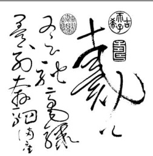

第 6 页

$$   共 11 页  $$

## 19-21為題組。閱讀下文，回答19-21題。

西元八世纪左右的盛唐，出现一種新型態的草書，後人以「狂草」稱呼。唐代狂草真跡存世者寥寥無幾，草書名品多以摹本、臨本、仿本或刻本的形式廣為流傳。今傳世名聲最大、影響最廣的狂草作品，堪稱唐代僧人懷素的〈自敘帖〉長卷。

〈自敘帖〉本幅部分書有126行，702字，是懷素自述出身、經歷與交遊的重要文献。懷素二十餘歲即以草書聞名， 並以驚人的即席表演結交當代名公。〈自敘帖〉中将近一半篇幅節錄眾人觀其作書有感所撰之詩作，描述他在眾人圍觀下激情揮毫的景況，例如：「奔蛇走虺勢入座，驟雨旋風聲滿堂」、「筆下唯看激電流，字成只畏盤龍走」、「醉來信手雨三行，醒後卻書書不得」、「心手相師勢轉奇，詭形怪狀翻合宜」、「忽然絕叫三五聲，滿壁縱横千萬字」、 「遠鶴無前侣，孤雲寄太虚。狂來輕世界，醉裡得真如」等，為八世纪的書法表演現場留下難得的紀錄。懷素的書法表演

故宫博物院为庆祝百年院庆，透过果实合作，推出〈自叙帖〉特仕版电动摩托车，将草书意境融入设计中。

颇富神異色彩，筆下充满驚奇的物象變化，詩作中還有人強調連懷素自己也不知如何寫成的。在觀賞者眼中，懷素能在草書中興風作浪、幻化出種種物象的能力，恐怕是當時人的普遍認知與期待，是唐代佛道盛行、社會瀰漫濃厚宗教氛圍下的産物。

〈自叙帖〉書法用筆迅速，筆勢連綿，然字形結構謹守草法，線條穩定圓轉。全卷可見節奏緩起漸怏，卷中段以後愈書愈放，但絕非倚靠靈感驅使的即興之作。國立故宫博物院藏本〈自叙帖〉，每行第一字墨色飽満，漸寫漸乾，直到寫完行末最後一字。所谓「法度」看似不存在，卻其實無所不在，是興風作浪的浪漫藉以依存的基礎。 （改寫自廬慧紋〈興風作浪的浪漫〉）

19. 依据上文，關於〈自敘帖〉中詩作對懷素其人其書的描述，說明最適當的是：

(A)以奔蛇、走虺、遠鶴等物象，說明運筆時身形的伸展變化(B)以盤龍走、滿壁縱橫，形容其運筆速度時而迅疾時而徐緩(C)下筆時近乎顛狂且不忌飲酒，觀者卻能從中印證佛道之理(D)心手相師，乍看怪異不合常軌，卻能引發觀者多重的聯想

20. 關於上文對〈自敘帖〉的敘迹，最適當的是：
(A)觀者可以透過墨色由濃到淡的變化，推想其换行蘸墨的規律
(B)藉助神異力量書寫的怪奇字形，具奔放不拘且震懾人心之美
(C)以摹本、臨本、仿本或刻本的形式流傳，故宫所藏為唯一存世真跡
(D)後人可從中了解懷素的交遊、師承，以及書寫時的構思和創作理念

21. 依据上文，關於懷素〈自敘帖〉中所錄眾人詩作的價值，敘述最適當的是：

(A)留存盛唐时藝文活動的珍貴剪影

(B)記錄當時不被人知的狂草書法家

(C)提供後人臨摹狂草的造型與布局

(D)揭示法度為浪漫得以穩定的憑藉

